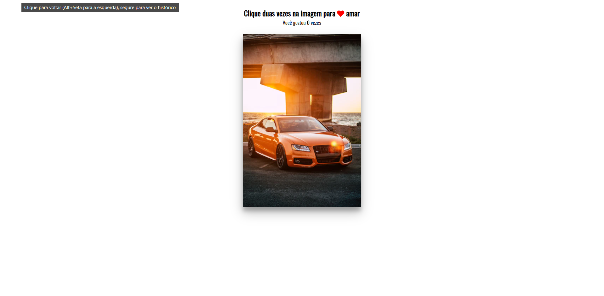

# Projeto de duplo click

> Novos desafios propostos com as tecnologias usadas

[Acesse aqui](https://prdsilva80.github.io/clique-duplo-para-amar/)

## 🛠️ Tecnologias

- HTML
- CSS
- JAVASCRIPT

## 👨‍🎓 O que aprendi

- Entendi melhor como aplicar o css
- No javascript usei novos comandos

# 🔗 contato

- probertos717@gmail.com